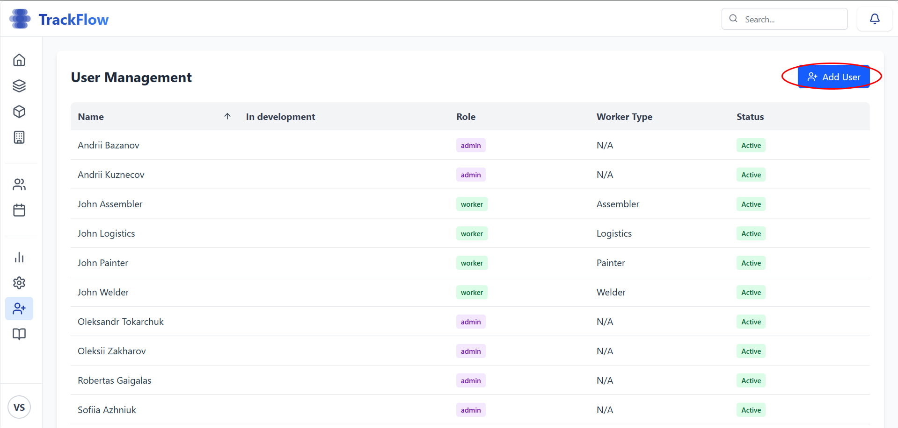
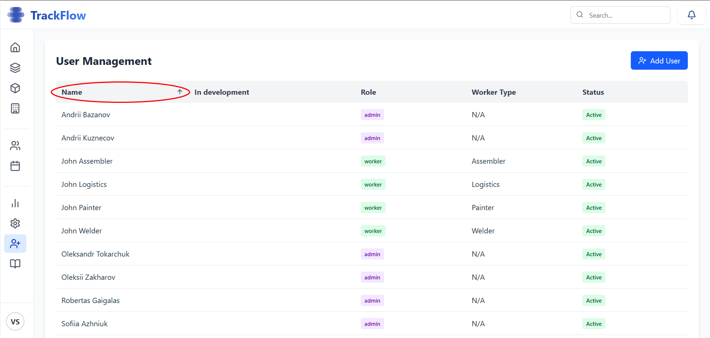
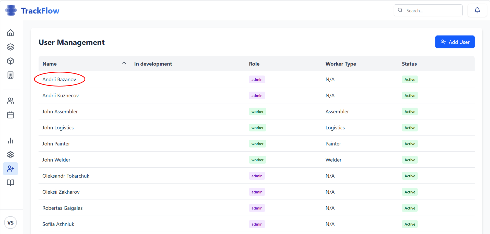
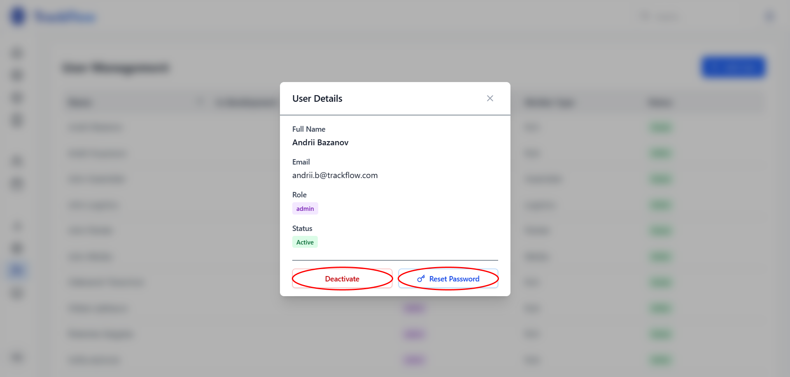

### User Management Overview

The User Management view allows you to control all the persons that are working in the company and manage their information: 

-**Adding Users**: Click on the + Add User button to add a new user

To create a new user you need to enter worker's email, full name, role and worker type if needed.
**Role management:**
1. Worker: Engineer, Welder, Assembler, Painter, Logistics
2. Manager
3. Admin

Then you can choose to auto-generate password or entrer it manually. 

-**Sort**: Click on the column name to sort the user list

-**User Details**: Click on the user name to see details

-**User Deactivating and Password Resetting**: Click on the user name to deactivate user or reset password. If you deactivate the user, worker will no longer have access to the webpage or mobile application. If you reset user's password, new password will be automatically generated. Please securely share new password with the user, they will need to change it on first login.

